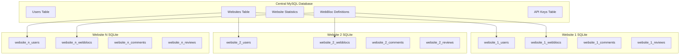
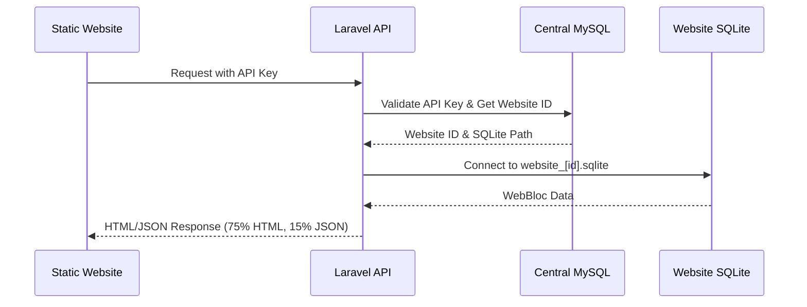
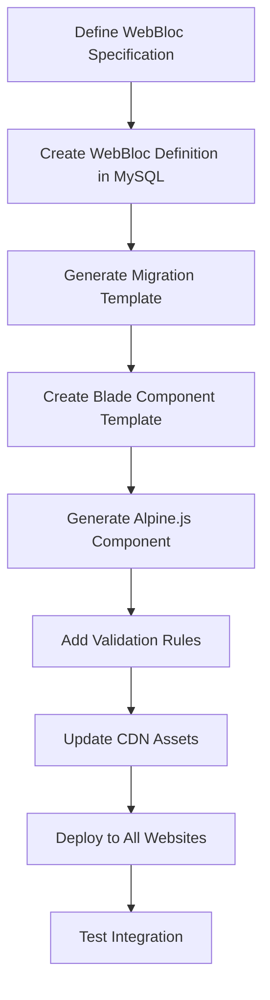

# SQLite Per Website Architecture & WebBloc Creation Guide

## 1. SQLite Per Website Architecture

### 1.1 Architecture Overview



### 1.2 Database Connection Flow



### 1.3 SQLite Database Structure Per Website

Each website gets its own SQLite database with the following structure:

```sql
-- SQLite Database: storage/databases/website_[id].sqlite

-- Website-specific users table
CREATE TABLE users (
    id INTEGER PRIMARY KEY AUTOINCREMENT,
    name VARCHAR(255) NOT NULL,
    email VARCHAR(255) UNIQUE NOT NULL,
    email_verified_at DATETIME,
    password VARCHAR(255),
    remember_token VARCHAR(100),
    avatar TEXT,
    metadata JSON,
    created_at DATETIME DEFAULT CURRENT_TIMESTAMP,
    updated_at DATETIME DEFAULT CURRENT_TIMESTAMP
);

-- Generic WebBloc data table
CREATE TABLE web_blocs (
    id INTEGER PRIMARY KEY AUTOINCREMENT,
    webbloc_type VARCHAR(50) NOT NULL,
    user_id INTEGER,
    page_url VARCHAR(500) NOT NULL,
    data JSON NOT NULL,
    metadata JSON,
    status VARCHAR(20) DEFAULT 'active',
    parent_id INTEGER,
    sort_order INTEGER DEFAULT 0,
    created_at DATETIME DEFAULT CURRENT_TIMESTAMP,
    updated_at DATETIME DEFAULT CURRENT_TIMESTAMP,
    FOREIGN KEY (user_id) REFERENCES users(id),
    FOREIGN KEY (parent_id) REFERENCES web_blocs(id)
);

-- Indexes for performance
CREATE INDEX idx_web_blocs_type ON web_blocs(webbloc_type);
CREATE INDEX idx_web_blocs_page_url ON web_blocs(page_url);
CREATE INDEX idx_web_blocs_user_id ON web_blocs(user_id);
CREATE INDEX idx_web_blocs_parent_id ON web_blocs(parent_id);
CREATE INDEX idx_web_blocs_created_at ON web_blocs(created_at);
```

### 1.4 Dynamic SQLite Connection Service


## 2. WebBloc Data Structure Standards

### 2.1 WebBloc Definition (MySQL Central)

```json
{
    "type": "comment",
    "name": "Comments System",
    "version": "1.0.0",
    "attributes": {
        "content": {
            "type": "text",
            "required": true,
            "validation": "min:1|max:1000"
        },
        "rating": {
            "type": "integer",
            "required": false,
            "validation": "min:1|max:5"
        },
        "author_name": {
            "type": "string",
            "required": true,
            "validation": "min:2|max:100"
        }
    },
    "crud": {
        "create": true,
        "read": true,
        "update": true,
        "delete": true
    },
    "metadata": {
        "description": "Dynamic commenting system",
        "icon": "message-circle",
        "category": "social"
    }
}
```

### 2.2 WebBloc Instance Data (SQLite Per Website)

```json
{
    "id": 1,
    "webbloc_type": "comment",
    "user_id": 123,
    "page_url": "/blog/post-1",
    "data": {
        "content": "This is a great post!",
        "author_name": "John Doe",
        "rating": 5
    },
    "metadata": {
        "ip_address": "192.168.1.1",
        "user_agent": "Mozilla/5.0...",
        "moderation_status": "approved"
    },
    "status": "active",
    "parent_id": null,
    "sort_order": 0,
    "created_at": "2024-01-01 12:00:00",
    "updated_at": "2024-01-01 12:00:00"
}
```

## 3. Complete WebBloc Creation Guide

### 3.1 WebBloc Creation Workflow



### 3.2 Step-by-Step WebBloc Creation Process

#### Step 1: Define WebBloc Specification

Create a specification file following this template:

```json
{
    "type": "testimonial",
    "name": "Testimonials System",
    "version": "1.0.0",
    "description": "Customer testimonials and reviews system",
    "category": "marketing",
    "icon": "star",
    "attributes": {
        "customer_name": {
            "type": "string",
            "required": true,
            "validation": "min:2|max:100",
            "label": "Customer Name",
            "placeholder": "Enter customer name"
        },
        "customer_title": {
            "type": "string",
            "required": false,
            "validation": "max:150",
            "label": "Customer Title",
            "placeholder": "Job title or position"
        },
        "testimonial_text": {
            "type": "text",
            "required": true,
            "validation": "min:10|max:500",
            "label": "Testimonial",
            "placeholder": "Enter testimonial text"
        },
        "rating": {
            "type": "integer",
            "required": true,
            "validation": "min:1|max:5",
            "label": "Rating",
            "default": 5
        },
        "customer_image": {
            "type": "file",
            "required": false,
            "validation": "image|max:2048",
            "label": "Customer Photo"
        },
        "company_name": {
            "type": "string",
            "required": false,
            "validation": "max:100",
            "label": "Company Name",
            "placeholder": "Company or organization"
        },
        "display_order": {
            "type": "integer",
            "required": false,
            "validation": "min:0|max:9999",
            "label": "Display Order",
            "default": 0
        }
    },
    "crud": {
        "create": true,
        "read": true,
        "update": true,
        "delete": true
    },
    "permissions": {
        "public_create": false,
        "authenticated_create": true,
        "owner_update": true,
        "admin_moderate": true
    },
    "display_options": {
        "default_limit": 6,
        "sort_options": ["newest", "oldest", "rating", "display_order"],
        "filter_options": ["rating", "company"],
        "pagination": true
    },
    "integration": {
        "css_classes": "webbloc-testimonials",
        "wrapper_tag": "div",
        "responsive": true,
        "themes": ["default", "card", "carousel"]
    }
}
```

#### Step 2: Run WebBloc Creation Command

```bash
php artisan make:webbloc testimonial --spec=testimonial-spec.json
```

This command will:
1. Create WebBloc definition in MySQL
2. Generate all necessary files
3. Update CDN assets
4. Install to existing websites (optional)

#### Step 3: Generated File Structure

The command creates these files automatically:

```
app/WebBlocs/Testimonial/
├── TestimonialWebBloc.php          # WebBloc class definition
├── TestimonialValidator.php        # Validation rules
├── TestimonialTransformer.php      # Data transformation
└── TestimonialRenderer.php         # HTML rendering logic

resources/views/webbloc/testimonial/
├── default.blade.php               # Default theme template
├── card.blade.php                  # Card theme template
├── carousel.blade.php              # Carousel theme template
└── form.blade.php                  # Creation/editing form

resources/js/webbloc/
└── testimonial.js                  # Alpine.js component

resources/css/webbloc/
└── testimonial.css                 # Component styling
```

#### Step 4: WebBloc Class Implementation

```php
<?php
// app/WebBlocs/Testimonial/TestimonialWebBloc.php

namespace App\WebBlocs\Testimonial;

use App\WebBlocs\BaseWebBloc;

class TestimonialWebBloc extends BaseWebBloc
{
    protected string $type = 'testimonial';
    
    protected array $fillable = [
        'customer_name',
        'customer_title', 
        'testimonial_text',
        'rating',
        'customer_image',
        'company_name',
        'display_order'
    ];

    protected array $casts = [
        'rating' => 'integer',
        'display_order' => 'integer'
    ];

    public function getValidationRules(string $method = 'POST'): array
    {
        return [
            'customer_name' => 'required|string|min:2|max:100',
            'customer_title' => 'nullable|string|max:150',
            'testimonial_text' => 'required|string|min:10|max:500',
            'rating' => 'required|integer|min:1|max:5',
            'customer_image' => 'nullable|image|max:2048',
            'company_name' => 'nullable|string|max:100',
            'display_order' => 'nullable|integer|min:0|max:9999'
        ];
    }

    public function transformForDisplay(array $data): array
    {
        return [
            'customer_name' => $data['customer_name'],
            'customer_title' => $data['customer_title'] ?? '',
            'testimonial_text' => $data['testimonial_text'],
            'rating' => (int) $data['rating'],
            'rating_stars' => str_repeat('★', $data['rating']) . str_repeat('☆', 5 - $data['rating']),
            'customer_image' => $data['customer_image'] ?? '/images/default-avatar.png',
            'company_name' => $data['company_name'] ?? '',
            'display_order' => (int) ($data['display_order'] ?? 0),
            'formatted_date' => $this->created_at->format('M j, Y')
        ];
    }

    public function renderHtml(array $options = []): string
    {
        $theme = $options['theme'] ?? 'default';
        $limit = $options['limit'] ?? 6;
        $sort = $options['sort'] ?? 'newest';
        
        $items = $this->getItems($limit, $sort, $options);
        
        return view("webbloc.testimonial.{$theme}", [
            'testimonials' => $items,
            'options' => $options,
            'webbloc_config' => $this->getConfiguration()
        ])->render();
    }

    private function getItems(int $limit, string $sort, array $options): array
    {
        $query = $this->newQuery();
        
        // Apply filters
        if (isset($options['rating_filter'])) {
            $query->where('data->rating', '>=', $options['rating_filter']);
        }
        
        if (isset($options['company_filter'])) {
            $query->where('data->company_name', 'LIKE', "%{$options['company_filter']}%");
        }
        
        // Apply sorting
        switch ($sort) {
            case 'oldest':
                $query->orderBy('created_at', 'asc');
                break;
            case 'rating':
                $query->orderByRaw("CAST(JSON_EXTRACT(data, '$.rating') AS INTEGER) DESC");
                break;
            case 'display_order':
                $query->orderByRaw("CAST(JSON_EXTRACT(data, '$.display_order') AS INTEGER) ASC");
                break;
            default: // newest
                $query->orderBy('created_at', 'desc');
        }
        
        return $query->limit($limit)
                    ->get()
                    ->map(fn($item) => $this->transformForDisplay($item->data))
                    ->toArray();
    }
}
```

#### Step 5: Blade Component Template

```html
<!-- resources/views/webbloc/testimonial/default.blade.php -->
<div x-data="testimonialWebBloc(@js($options))" 
     class="webbloc-testimonials {{ $options['css_classes'] ?? '' }}"
     x-init="init()">
     
    <!-- Loading State -->
    <template x-if="loading">
        <div class="webbloc-loading">
            <div class="spinner"></div>
            <span>Loading testimonials...</span>
        </div>
    </template>

    <!-- Error State -->
    <template x-if="error && !loading">
        <div class="webbloc-error alert alert-danger" x-text="errorMessage"></div>
    </template>

    <!-- Testimonials Grid -->
    <template x-if="!loading && !error">
        <div class="testimonials-container">
            
            <!-- Filters (if enabled) -->
            <template x-if="options.show_filters">
                <div class="testimonials-filters mb-4">
                    <div class="row">
                        <div class="col-md-6">
                            <select x-model="filters.rating" @change="applyFilters()" class="form-select">
                                <option value="">All Ratings</option>
                                <option value="5">5 Stars</option>
                                <option value="4">4+ Stars</option>
                                <option value="3">3+ Stars</option>
                            </select>
                        </div>
                        <div class="col-md-6">
                            <input type="text" 
                                   x-model="filters.company" 
                                   @keyup.debounce.500ms="applyFilters()" 
                                   placeholder="Filter by company"
                                   class="form-control">
                        </div>
                    </div>
                </div>
            </template>

            <!-- Testimonials Grid -->
            <div class="row testimonials-grid">
                <template x-for="testimonial in testimonials" :key="testimonial.id">
                    <div class="col-lg-4 col-md-6 mb-4">
                        <div class="testimonial-card card h-100">
                            <div class="card-body">
                                <!-- Rating Stars -->
                                <div class="testimonial-rating mb-3">
                                    <span x-html="testimonial.rating_stars" class="stars"></span>
                                </div>
                                
                                <!-- Testimonial Text -->
                                <blockquote class="testimonial-text mb-3">
                                    "<span x-text="testimonial.testimonial_text"></span>"
                                </blockquote>
                                
                                <!-- Customer Info -->
                                <div class="testimonial-author d-flex align-items-center">
                                    
                                    <div>
                                        <strong x-text="testimonial.customer_name" class="author-name"></strong>
                                        <template x-if="testimonial.customer_title">
                                            <div x-text="testimonial.customer_title" class="author-title text-muted small"></div>
                                        </template>
                                        <template x-if="testimonial.company_name">
                                            <div x-text="testimonial.company_name" class="author-company text-muted small"></div>
                                        </template>
                                    </div>
                                </div>
                            </div>
                            
                            <!-- Admin Actions (if user has permission) -->
                            <template x-if="canModerate && testimonial.can_edit">
                                <div class="card-footer">
                                    <button @click="editTestimonial(testimonial.id)" class="btn btn-sm btn-outline-primary">
                                        Edit
                                    </button>
                                    <button @click="deleteTestimonial(testimonial.id)" class="btn btn-sm btn-outline-danger ms-2">
                                        Delete
                                    </button>
                                </div>
                            </template>
                        </div>
                    </div>
                </template>
            </div>

            <!-- Load More Button -->
            <template x-if="hasMore && !loading">
                <div class="text-center mt-4">
                    <button @click="loadMore()" class="btn btn-outline-primary">
                        Load More Testimonials
                    </button>
                </div>
            </template>

            <!-- Add New Testimonial (if user has permission) -->
            <template x-if="canCreate">
                <div class="add-testimonial-section mt-5">
                    <h4>Share Your Experience</h4>
                    <form @submit.prevent="submitTestimonial()" class="testimonial-form">
                        <div class="row">
                            <div class="col-md-6 mb-3">
                                <label for="customer_name" class="form-label">Your Name *</label>
                                <input type="text" 
                                       x-model="newTestimonial.customer_name" 
                                       id="customer_name" 
                                       class="form-control" 
                                       required>
                            </div>
                            <div class="col-md-6 mb-3">
                                <label for="customer_title" class="form-label">Job Title</label>
                                <input type="text" 
                                       x-model="newTestimonial.customer_title" 
                                       id="customer_title" 
                                       class="form-control">
                            </div>
                        </div>
                        
                        <div class="row">
                            <div class="col-md-6 mb-3">
                                <label for="company_name" class="form-label">Company</label>
                                <input type="text" 
                                       x-model="newTestimonial.company_name" 
                                       id="company_name" 
                                       class="form-control">
                            </div>
                            <div class="col-md-6 mb-3">
                                <label for="rating" class="form-label">Rating *</label>
                                <select x-model="newTestimonial.rating" id="rating" class="form-select" required>
                                    <option value="">Select rating</option>
                                    <option value="5">5 Stars - Excellent</option>
                                    <option value="4">4 Stars - Very Good</option>
                                    <option value="3">3 Stars - Good</option>
                                    <option value="2">2 Stars - Fair</option>
                                    <option value="1">1 Star - Poor</option>
                                </select>
                            </div>
                        </div>
                        
                        <div class="mb-3">
                            <label for="testimonial_text" class="form-label">Your Testimonial *</label>
                            <textarea x-model="newTestimonial.testimonial_text" 
                                      id="testimonial_text" 
                                      rows="4" 
                                      class="form-control" 
                                      placeholder="Share your experience..."
                                      required></textarea>
                        </div>
                        
                        <div class="mb-3">
                            <label for="customer_image" class="form-label">Your Photo (optional)</label>
                            <input type="file" 
                                   @change="handleImageUpload($event)" 
                                   id="customer_image" 
                                   accept="image/*" 
                                   class="form-control">
                        </div>
                        
                        <button type="submit" 
                                :disabled="submitting" 
                                class="btn btn-primary">
                            <span x-show="!submitting">Submit Testimonial</span>
                            <span x-show="submitting">Submitting...</span>
                        </button>
                    </form>
                </div>
            </template>
        </div>
    </template>
</div>
```

#### Step 6: Alpine.js Component

```javascript
// resources/js/webbloc/testimonial.js

function testimonialWebBloc(options = {}) {
    return {
        // Component state
        loading: true,
        error: false,
        errorMessage: '',
        submitting: false,
        testimonials: [],
        hasMore: false,
        page: 1,
        
        // Configuration
        options: {
            limit: 6,
            sort: 'newest',
            theme: 'default',
            show_filters: false,
            show_form: true,
            ...options
        },
        
        // Filters
        filters: {
            rating: '',
            company: ''
        },
        
        // New testimonial form
        newTestimonial: {
            customer_name: '',
            customer_title: '',
            company_name: '',
            testimonial_text: '',
            rating: '',
            customer_image: null
        },
        
        // Permissions
        canCreate: false,
        canModerate: false,
        
        // Initialization
        init() {
            this.checkPermissions();
            this.loadTestimonials();
        },
        
        // Load testimonials from API
        async loadTestimonials(append = false) {
            this.loading = true;
            this.error = false;
            
            try {
                const params = new URLSearchParams({
                    page: append ? this.page : 1,
                    limit: this.options.limit,
                    sort: this.options.sort,
                    page_url: window.location.pathname,
                    ...this.filters
                });
                
                const response = await this.apiCall('GET', `/webblocs/testimonial?${params}`);
                
                if (append) {
                    this.testimonials.push(...response.data);
                } else {
                    this.testimonials = response.data;
                    this.page = 1;
                }
                
                this.hasMore = response.has_more || false;
                this.page++;
                
            } catch (error) {
                this.handleError(error);
            } finally {
                this.loading = false;
            }
        },
        
        // Load more testimonials
        async loadMore() {
            await this.loadTestimonials(true);
        },
        
        // Apply filters
        async applyFilters() {
            this.page = 1;
            await this.loadTestimonials(false);
        },
        
        // Submit new testimonial
        async submitTestimonial() {
            if (!this.canCreate) return;
            
            this.submitting = true;
            
            try {
                // Validate required fields
                if (!this.newTestimonial.customer_name || !this.newTestimonial.testimonial_text || !this.newTestimonial.rating) {
                    throw new Error('Please fill in all required fields');
                }
                
                const formData = new FormData();
                Object.keys(this.newTestimonial).forEach(key => {
                    if (this.newTestimonial[key] !== null && this.newTestimonial[key] !== '') {
                        formData.append(key, this.newTestimonial[key]);
                    }
                });
                formData.append('page_url', window.location.pathname);
                
                const response = await this.apiCall('POST', '/webblocs/testimonial', formData, {
                    'Content-Type': 'multipart/form-data'
                });
                
                // Add new testimonial to the beginning of the list
                this.testimonials.unshift(response.data);
                
                // Reset form
                this.newTestimonial = {
                    customer_name: '',
                    customer_title: '',
                    company_name: '',
                    testimonial_text: '',
                    rating: '',
                    customer_image: null
                };
                
                // Reset file input
                const fileInput = document.getElementById('customer_image');
                if (fileInput) fileInput.value = '';
                
                this.showNotification('Thank you for your testimonial!', 'success');
                
            } catch (error) {
                this.handleError(error);
            } finally {
                this.submitting = false;
            }
        },
        
        // Edit testimonial
        async editTestimonial(id) {
            // Implementation for editing testimonials
            const testimonial = this.testimonials.find(t => t.id === id);
            if (testimonial) {
                // Open modal or inline edit form
                // This would be implemented based on UI requirements
                console.log('Edit testimonial:', testimonial);
            }
        },
        
        // Delete testimonial
        async deleteTestimonial(id) {
            if (!this.canModerate) return;
            
            const confirmed = await this.confirmAction(
                'Delete Testimonial',
                'Are you sure you want to delete this testimonial?',
                'warning'
            );
            
            if (!confirmed) return;
            
            try {
                await this.apiCall('DELETE', `/webblocs/testimonial/${id}`);
                
                // Remove from local array
                this.testimonials = this.testimonials.filter(t => t.id !== id);
                
                this.showNotification('Testimonial deleted successfully', 'success');
                
            } catch (error) {
                this.handleError(error);
            }
        },
        
        // Handle image upload
        handleImageUpload(event) {
            const file = event.target.files[0];
            if (file) {
                // Validate file size and type
                if (file.size > 2048 * 1024) { // 2MB limit
                    this.showNotification('Image size must be less than 2MB', 'error');
                    event.target.value = '';
                    return;
                }
                
                if (!file.type.startsWith('image/')) {
                    this.showNotification('Please select a valid image file', 'error');
                    event.target.value = '';
                    return;
                }
                
                this.newTestimonial.customer_image = file;
            }
        },
        
        // Check user permissions
        checkPermissions() {
            const user = this.getCurrentUser();
            this.canCreate = this.options.allow_public_create || (user && this.options.allow_authenticated_create);
            this.canModerate = user && (user.role === 'admin' || user.role === 'moderator');
        },
        
        // API call helper
        async apiCall(method, endpoint, data = null, customHeaders = {}) {
            const url = `/api${endpoint}`;
            const headers = {
                'Authorization': `Bearer ${this.getApiKey()}`,
                'X-Website-ID': this.getWebsiteId(),
                'Accept': 'application/json',
                ...customHeaders
            };
            
            // Don't set Content-Type for FormData
            if (!(data instanceof FormData) && method !== 'GET') {
                headers['Content-Type'] = 'application/json';
            }
            
            const options = {
                method: method,
                headers: headers
            };
            
            if (data) {
                if (data instanceof FormData) {
                    options.body = data;
                } else if (method !== 'GET') {
                    options.body = JSON.stringify(data);
                }
            }
            
            const response = await fetch(url, options);
            
            if (!response.ok) {
                const errorData = await response.json().catch(() => ({}));
                throw new Error(errorData.message || `HTTP error! status: ${response.status}`);
            }
            
            return await response.json();
        },
        
        // Error handling
        handleError(error) {
            this.error = true;
            this.errorMessage = error.message || 'An error occurred';
            this.showNotification(this.errorMessage, 'error');
            console.error('WebBloc Error:', error);
        },
        
        // Notification helper
        showNotification(message, type = 'info') {
            if (typeof Swal !== 'undefined') {
                Swal.fire({
                    toast: true,
                    position: 'top-end',
                    showConfirmButton: false,
                    timer: 3000,
                    timerProgressBar: true,
                    icon: type,
                    title: message
                });
            } else {
                // Fallback to console if SweetAlert not available
                console.log(`${type.toUpperCase()}: ${message}`);
            }
        },
        
        // Confirmation dialog
        async confirmAction(title, text, type = 'warning') {
            if (typeof Swal !== 'undefined') {
                const result = await Swal.fire({
                    title: title,
                    text: text,
                    icon: type,
                    showCancelButton: true,
                    confirmButtonColor: '#d33',
                    cancelButtonColor: '#3085d6',
                    confirmButtonText: 'Yes, proceed!'
                });
                return result.isConfirmed;
            } else {
                return confirm(`${title}\n\n${text}`);
            }
        },
        
        // Helper methods
        getApiKey() {
            return document.querySelector('[data-webbloc-api-key]')?.dataset.webblocApiKey || '';
        },
        
        getWebsiteId() {
            return document.querySelector('[data-webbloc-website-id]')?.dataset.webblocWebsiteId || '';
        },
        
        getCurrentUser() {
            const userEl = document.querySelector('[data-webbloc-user]');
            return userEl ? JSON.parse(userEl.dataset.webblocUser || '{}') : null;
        }
    }
}

// Make function globally available
window.testimonialWebBloc = testimonialWebBloc;
```

#### Step 7: CSS Styling

```css
/* resources/css/webbloc/testimonial.css */

.webbloc-testimonials {
    font-family: -apple-system, BlinkMacSystemFont, 'Segoe UI', Roboto, sans-serif;
}

.webbloc-loading {
    text-align: center;
    padding: 2rem;
    color: #6c757d;
}

.webbloc-loading .spinner {
    display: inline-block;
    width: 20px;
    height: 20px;
    border: 2px solid #f3f3f3;
    border-top: 2px solid #007bff;
    border-radius: 50%;
    animation: spin 1s linear infinite;
    margin-right: 0.5rem;
}

@keyframes spin {
    0% { transform: rotate(0deg); }
    100% { transform: rotate(360deg); }
}

.testimonials-filters {
    background: #f8f9fa;
    padding: 1rem;
    border-radius: 0.375rem;
    margin-bottom: 1.5rem;
}

.testimonial-card {
    border: 1px solid #dee2e6;
    border-radius: 0.5rem;
    transition: transform 0.2s ease-in-out, box-shadow 0.2s ease-in-out;
    height: 100%;
}

.testimonial-card:hover {
    transform: translateY(-2px);
    box-shadow: 0 4px 12px rgba(0,0,0,0.1);
}

.testimonial-rating .stars {
    color: #ffc107;
    font-size: 1.2rem;
}

.testimonial-text {
    font-style: italic;
    font-size: 0.95rem;
    line-height: 1.6;
    color: #495057;
    margin: 0;
}

.author-avatar {
    object-fit: cover;
    border: 2px solid #e9ecef;
}

.author-name {
    font-size: 0.9rem;
    color: #212529;
}

.author-title, .author-company {
    font-size: 0.8rem;
    color: #6c757d;
}

.testimonial-form {
    background: #f8f9fa;
    padding: 2rem;
    border-radius: 0.5rem;
    border: 1px solid #dee2e6;
}

.testimonial-form .form-label {
    font-weight: 600;
    color: #495057;
    margin-bottom: 0.5rem;
}

.testimonial-form .form-control,
.testimonial-form .form-select {
    border-radius: 0.375rem;
    border: 1px solid #ced4da;
    transition: border-color 0.15s ease-in-out, box-shadow 0.15s ease-in-out;
}

.testimonial-form .form-control:focus,
.testimonial-form .form-select:focus {
    border-color: #86b7fe;
    outline: 0;
    box-shadow: 0 0 0 0.25rem rgba(13, 110, 253, 0.25);
}

.testimonials-grid .col-lg-4:nth-child(3n+1) .testimonial-card {
    border-left: 4px solid #007bff;
}

.testimonials-grid .col-lg-4:nth-child(3n+2) .testimonial-card {
    border-left: 4px solid #28a745;
}

.testimonials-grid .col-lg-4:nth-child(3n+3) .testimonial-card {
    border-left: 4px solid #ffc107;
}

/* Responsive adjustments */
@media (max-width: 768px) {
    .testimonial-form {
        padding: 1rem;
    }
    
    .author-avatar {
        width: 40px !important;
        height: 40px !important;
    }
    
    .testimonial-rating .stars {
        font-size: 1rem;
    }
}

/* Card theme variations */
.webbloc-testimonials.theme-card .testimonial-card {
    background: linear-gradient(135deg, #667eea 0%, #764ba2 100%);
    color: white;
    border: none;
}

.webbloc-testimonials.theme-card .testimonial-text {
    color: rgba(255,255,255,0.9);
}

.webbloc-testimonials.theme-card .author-name {
    color: white;
}

.webbloc-testimonials.theme-card .author-title,
.webbloc-testimonials.theme-card .author-company {
    color: rgba(255,255,255,0.7);
}

/* Carousel theme */
.webbloc-testimonials.theme-carousel {
    overflow: hidden;
}

.webbloc-testimonials.theme-carousel .testimonials-grid {
    display: flex;
    transition: transform 0.3s ease;
}

.webbloc-testimonials.theme-carousel .testimonials-grid > div {
    flex: 0 0 100%;
}

@media (min-width: 768px) {
    .webbloc-testimonials.theme-carousel .testimonials-grid > div {
        flex: 0 0 50%;
    }
}

@media (min-width: 992px) {
    .webbloc-testimonials.theme-carousel .testimonials-grid > div {
        flex: 0 0 33.333%;
    }
}
```

#### Step 8: Installation and Deployment

```bash
# Install the new WebBloc to all websites
php artisan webbloc:install testimonial --websites=all

# Or install to specific website
php artisan webbloc:install testimonial --website-id=1

# Rebuild CDN files
php artisan webbloc:build-cdn

# Check installation status
php artisan webbloc:status testimonial
```

#### Step 9: Integration in Static Websites

```html
<!DOCTYPE html>
<html lang="en">
<head>
    <meta charset="UTF-8">
    <meta name="viewport" content="width=device-width, initial-scale=1.0">
    <title>My Static Website</title>
    
    <!-- Bootstrap CSS -->
    <link href="https://cdn.jsdelivr.net/npm/bootstrap@5.1.3/dist/css/bootstrap.min.css" rel="stylesheet">
    
    <!-- WebBloc CSS -->
    <link rel="stylesheet" href="https://w.2030b.com/cdn/webbloc.min.css">
</head>
<body>
    <!-- WebBloc Configuration -->
    <div data-webbloc-api-key="your-api-key-here" 
         data-webbloc-website-id="your-website-id-here"
         data-webbloc-user='{"id": 123, "name": "John Doe", "role": "user"}'></div>

    <div class="container my-5">
        <h1>Customer Testimonials</h1>
        
        <!-- Default testimonials display -->
        <div w2030b="testimonial" 
             w2030b_tags='{"limit": 6, "sort": "newest", "theme": "default", "show_filters": true}'>
            Loading testimonials...
        </div>
        
        <!-- Card theme testimonials -->
        <div w2030b="testimonial" 
             w2030b_tags='{"limit": 3, "sort": "rating", "theme": "card", "show_form": false}'>
            Loading featured testimonials...
        </div>
        
        <!-- Carousel theme testimonials -->
        <div w2030b="testimonial" 
             w2030b_tags='{"limit": 9, "theme": "carousel", "auto_rotate": true}'>
            Loading testimonial carousel...
        </div>
    </div>

    <!-- SweetAlert2 for notifications -->
    <script src="https://cdn.jsdelivr.net/npm/sweetalert2@11"></script>
    
    <!-- WebBloc JavaScript -->
    <script src="https://w.2030b.com/cdn/webbloc.min.js"></script>
</body>
</html>
```

## 4. WebBloc Management Commands

### 4.1 Available Commands

```bash
# Create new WebBloc
php artisan make:webbloc [type] --spec=[spec-file.json]

# Install WebBloc to websites
php artisan webbloc:install [type] [--website-id=ID] [--websites=all]

# Remove WebBloc from websites
php artisan webbloc:remove [type] [--website-id=ID] [--websites=all]

# List all WebBlocs
php artisan webbloc:list

# Check WebBloc status
php artisan webbloc:status [type]

# Update WebBloc definition
php artisan webbloc:update [type] --spec=[spec-file.json]

# Build CDN files
php artisan webbloc:build-cdn

# Migrate WebBloc data
php artisan webbloc:migrate [type] --from-version=[old] --to-version=[new]
```

### 4.2 WebBloc Configuration Management

```bash
# Export WebBloc configuration
php artisan webbloc:export [type] --output=[file.json]

# Import WebBloc configuration
php artisan webbloc:import --spec=[file.json]

# Validate WebBloc specification
php artisan webbloc:validate --spec=[file.json]

# Generate WebBloc documentation
php artisan webbloc:docs [type] --output=[docs/]
```

This comprehensive guide provides everything needed to understand the SQLite per-website architecture and create new WebBlocs from specification to deployment. The system ensures data isolation, security, and easy integration while maintaining the 75% HTML, 15% JSON output format requirements.
